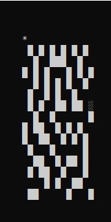

# Solve-The-Maze-Game
A maze game built using C++

# Instructions
The game will ask you to enter the following:
* Dimentions of the matrix :
  * Length
  * Breadth
* The x and y coordinates of the point you want to start at (like 0,0 or 0,15)
* The x and y coordinates of the point at which you want to exit the maze 

The player is represented as '*'
